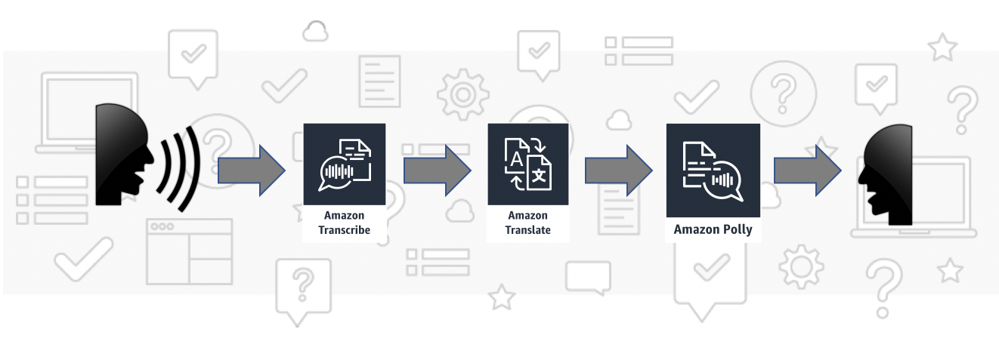

# Build a Babel Fish with Machine Learning Language Services

This repository contains necessary resources for AWS workshop. In this readme you will find detailed instructions for each phase of the workshop.

The process of building your own Babel Fish will be split into four phases. In each phase you will add a new functionality to your solution by using one of the AI services from AWS portfolio.

