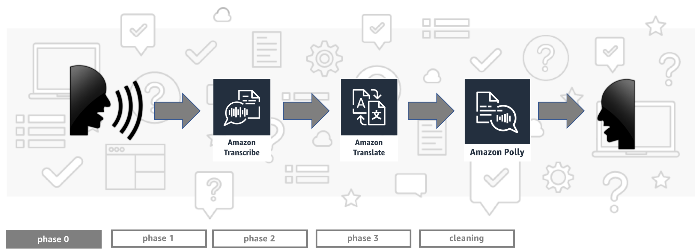

# Build a Babel Fish with Machine Learning Language Services

This repository contains necessary resources for AWS re:Invent 2018 workshop AIM313. In this readme you will find detailed instructions for `Phase 0`.

## Phase 0: Environment setup

1. Sign into the AWS Console and choose `eu-west-1` (Ireland) region. Open the link below in a new tab to launch CloudFormation stack in your AWS account. It will configure your environment with resources necessary to run this workshop.

2. Move through the wizard (`Next`, `Next`, `Next`), on `Review` page acknowledge that CloudFormation might create IAM resources and click `Create`. Wait a few moments until status changes from `CREATE_IN_PROGRESS` to `CREATE_COMPLETE`.

3. On `Stacks` page click stack name to view `Stack Detail` page and expand `Outputs` section. In `Key` column find the following  items and copy their `Value` values for later use:

    * `IdentityPoolIdOutput` - Identity Pool ID.
    * `S3BucketOutput` - S3 bucket name.
    * `BabelFishLink` - Link to your Babel Fish app.

4. Download zip file with the content of this repo using this [link](https://github.com/maciejchmielarz/babel-fish/archive/master.zip), extract it and find Babel Fish app files listed under `guide/phase0`:

    * `babel-fish.css`
    * `babel-fish.html`
    * `babel-fish.js`

5. Update your local JavaScript app `babel-fish.js` and replace placeholders with correct configuration data:

    1. Provide your S3 bucket name in line 3.
    1. Provide your Identity Pool ID in line 4.

7. Upload Babel Fish app files (`babel-fish.css`, `babel-fish.html` and `babel-fish.js`) to the S3 bucket which was created in the previous steps.

During this workshop you will be implementing app logic in Lambda functions created by CloudFormation. Please note that those functions use `Python 3.6` by default and while it's absolutely not a problem to use other programming languages to develop this solution, only `Python` is actively supported during this workshop.

## Testing

> Hint: If you want to use Babel Fish app online (served from S3) we strongly recommend to use Firefox browser. It may not work in other browsers, e.g. it doesn't work in Chrome because this browser doesn't allow for voice recording on insecure origins (served without TLS). If you really want to use Chrome you can easily work around this by opening a local copy of the app from your machine.

To test this part of implementation, open the `BabelFishLink` that you copied in step 3, record yourself or upload an audio file (you can use example files from this directory: `my-car.mp3` or `mi-coche.mp3`) and verify in the S3 bucket if an audio file is put into `input` folder. At this point your app will show `Processing...` and will eventually timeout because all the backend parts are not implemented... yet :)

> Hint: If it didn't work you may start troubleshooting by checking browser's JavaScript console for app errors (see relevant documentation for [Firefox](https://developer.mozilla.org/en-US/docs/Tools/Browser_Console) and [Chrome](https://developers.google.com/web/tools/chrome-devtools/console/)).

**Once you're finished with this phase please wait for speakers to present the next one before moving forward.**

