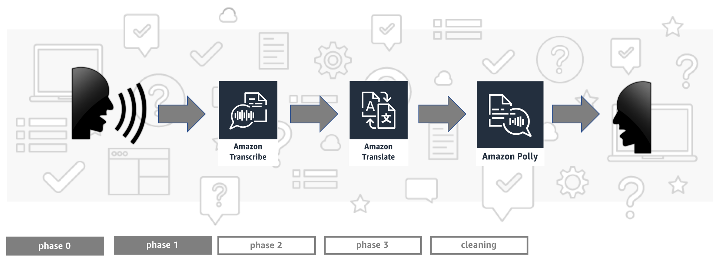

# Build a Babel Fish with Machine Learning Language Services

This repository contains necessary resources for AWS re:Invent 2018 workshop AIM313. In this readme you will find detailed instructions for `Phase 1`.

## Phase 1: Convert audio to text

Use Lambda service in the AWS Console to open `TranscribeLambda` function. In the `Add triggers` section on the left configure trigger for this function:

1. Choose S3 as the trigger and go to the `Configure triggers` section.
1. Pick correct S3 bucket name.
1. Pick `PUT` as event type.
1. Put `input/` as prefix.
1. Put `.mp3` as suffix.
1. Click `Add` at the bottom of the page to add trigger.
1. Click `Save` at the top of the page to confirm changes to the function.
1. Add a second trigger. Exactly this same as the previous one, but this time, the suffix should be `.wav`.

Implement the function to use audio file link and transcribe it with Amazon Transcribe.

> Hint: JavaScript app uses a following format to name the files: `xx-yy-guid.ext`, where `xx` is the input language, `yy` is the output language, `guid` is a unique identifier and `ext` is the uploaded audio file extension or `wav` for recordings.

> Hint: Your function should request Amazon Transcribe to put results in project's S3 bucket and use the same file naming convention as Babel Fish JavaScript component.

> Hint: You may want to look up [Amazon Transcribe Boto 3 Docs](https://boto3.amazonaws.com/v1/documentation/api/latest/reference/services/transcribe.html) or inspire yourself with [Amazon Transcribe Getting Started](https://docs.aws.amazon.com/transcribe/latest/dg/getting-started-python.html).

> Hint: Getting behind? No worries, we've got you covered! When the time is up speakers will provide the password to the `solution.zip` file with a ready solution and will show how to apply it to unblock next steps.

## Testing

To test this part of implementation, open your Babel Fish web app, record yourself or upload an audio file (you can use example files from the setup phase) and verify in the S3 bucket if a `json` file with transcription result is created.

> Hint: If it didn't work you may start troubleshooting by:
> 1. checking Transcribe jobs in the AWS Console for any `IN PROGRESS` or `FAILED` items,
> 1. checking Lambda function logs in CloudWatch for errors (navigate to `Monitoring` tab in the AWS Console, see relevant documentation [here](https://docs.aws.amazon.com/lambda/latest/dg/monitoring-functions-logs.html)).

**Once you're finished with this phase please wait for speakers to present the next one before moving forward.**

